## 🔐 Login & Register Page – Level 6 Authentication (OAuth + Session-Based Authentication)

This project builds on Level 5 and adds Google OAuth 2.0 login, so users can log in using their Google account. It uses Node.js, Express, EJS, PostgreSQL, Passport.js, and environment variables.
---
Features:

Users can register with email/password (Level 5 auth).
Users can log in via Google OAuth 2.0.
Session-based authentication persists across pages using express-session.
Protected routes like /secrets are accessible only if authenticated.
Database credentials and session secrets are stored in .env.
---
🔑 Levels of Authentication:<br><br>
Level 1: Basic Cipher (Caesar, Hill, Playfair, etc.)<br>
Level 2: Hashing (MD5, SHA, etc.)<br>
Level 3: Hashing + Salt Rounds (bcrypt)<br>
Level 4: Session-Based Authentication (bcrypt + Passport.js + Cookies)<br>
Level 5: Environment Variables + Session-Based Authentication<br>
Level 6: OAuth (Open Authorization) 

---
## 📷 Gallery

| SignUp Page | Login Page |
|-------------|------------|
|  | 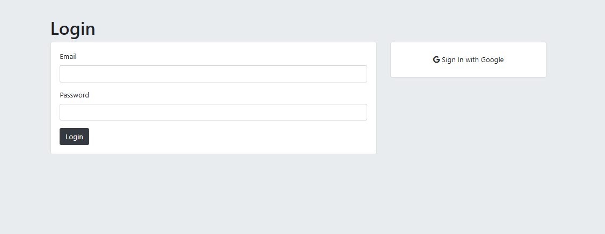 |

| Register Page | Secret Page |
|---------------|-------------|
| 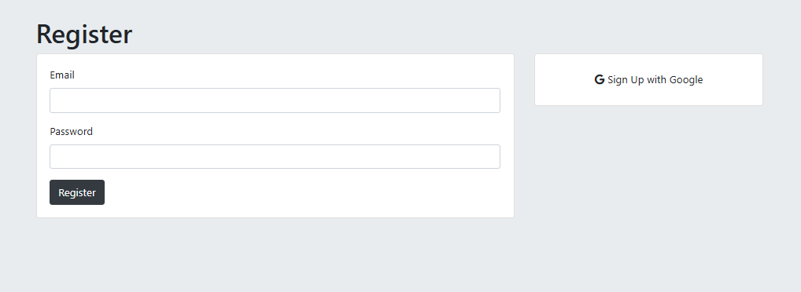 | 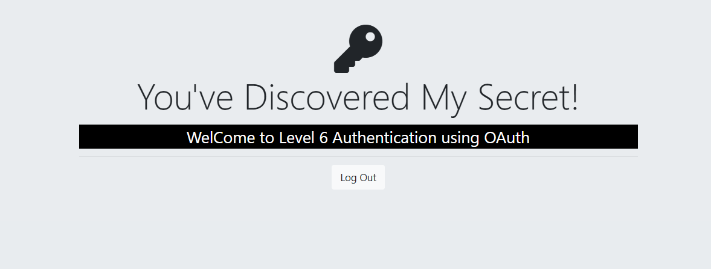 |

| DataBase |
|---------------|
| 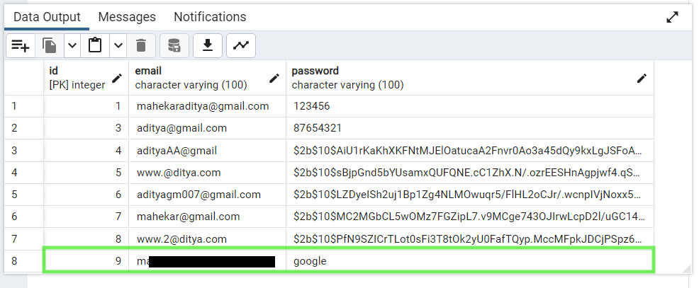 |


---

## ⚙️ Setup Instructions

 1️⃣ Create Table in PostgreSQL(users):
 <br><br>
as given in the query.sql
 <br>
 
2️⃣ Install Dependencies:
```bash
npm i
npm i pg express ejs body-parser
```

| 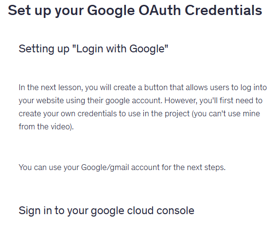 | 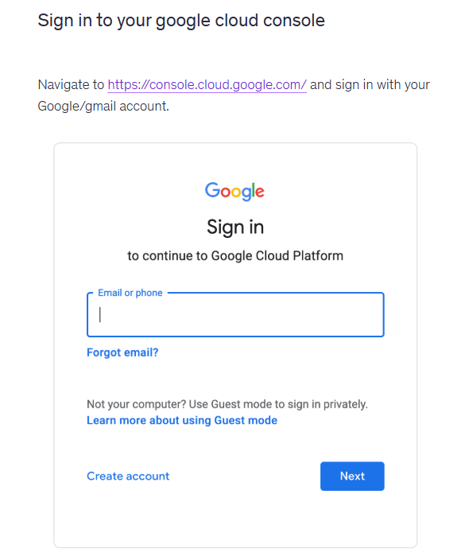 | 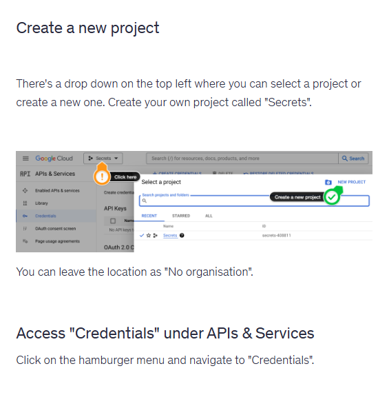 | 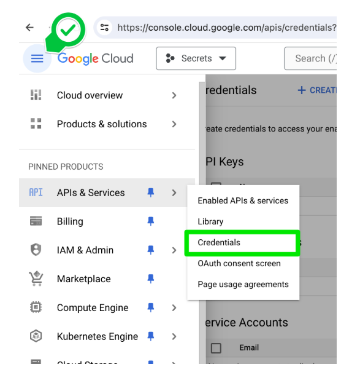 | 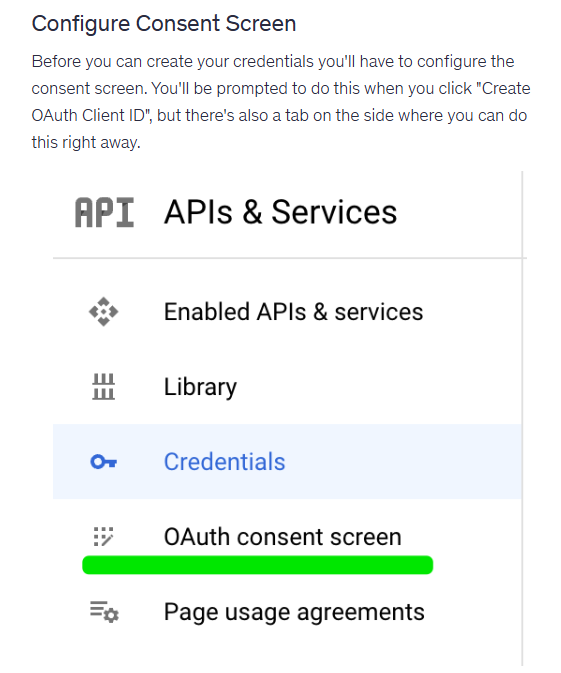 | 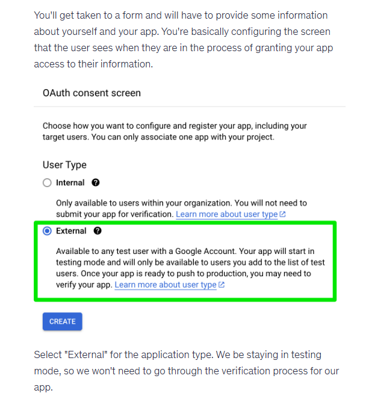 |  | 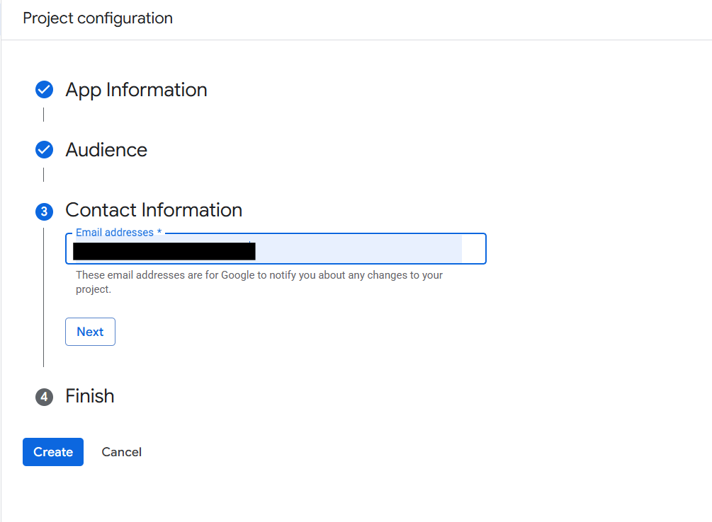 | 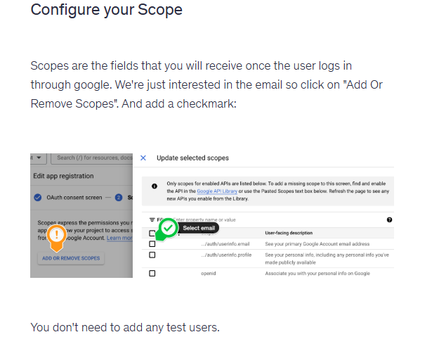 | 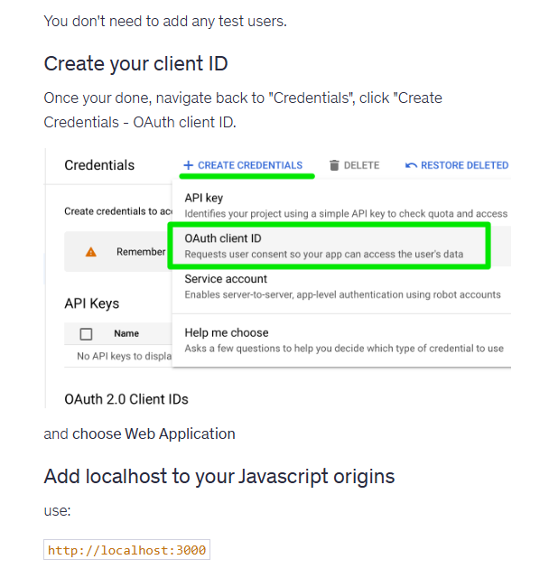 | 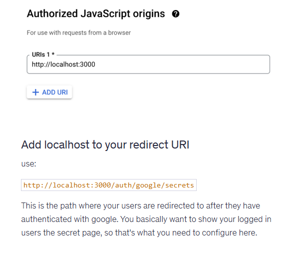 | 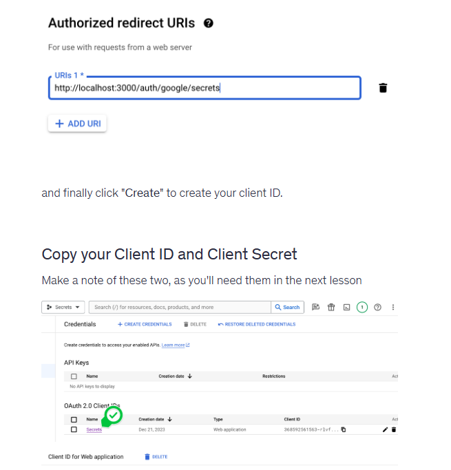 | 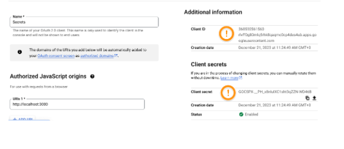 |
|---|---|---|---|---|---|---|---|---|---|---|---|---|


4️⃣ Run Server:
```bash
node index.js
```
---
👉 [Open App on Localhost](http://localhost:3000)
