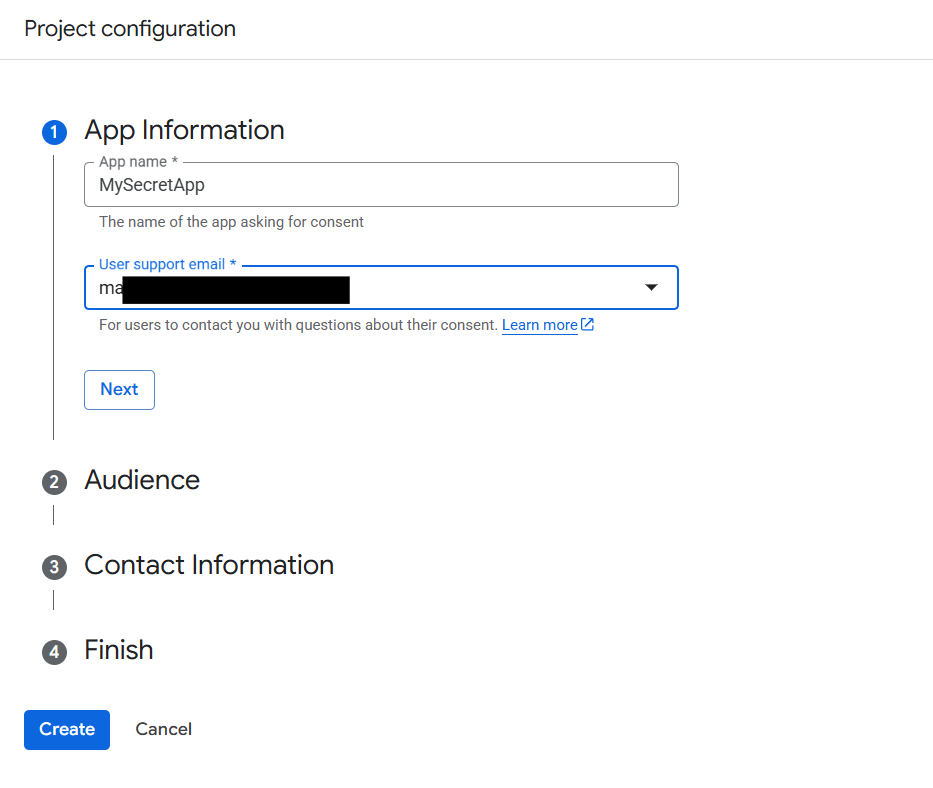

## 🔐 Login & Register Page – Level 6 Authentication (OAuth + Session-Based Authentication)

This project extends Level 5 Authentication by adding Google OAuth 2.0 login. Users can log in either with their email/password or via their Google account. The application uses Node.js, Express, EJS, PostgreSQL, Passport.js, and environment variables for secure configuration.

---
Features:

- Users can register with email and password (Level 5 auth).
- Users can log in using their Google account via OAuth 2.0.
- Session-based authentication ensures users stay logged in across pages.
- Protected routes like /secrets are accessible only to authenticated users.
- Database credentials and session secrets are securely stored in a `.env` file.

---
🔑 Levels of Authentication:<br><br>
Level 1: Basic Cipher (Caesar, Hill, Playfair, etc.)<br>
Level 2: Hashing (MD5, SHA, etc.)<br>
Level 3: Hashing + Salt Rounds (bcrypt)<br>
Level 4: Session-Based Authentication (bcrypt + Passport.js + Cookies)<br>
Level 5: Environment Variables + Session-Based Authentication<br>
Level 6: OAuth (Open Authorization) 

---
## 📷 Gallery

| SignUp Page | Login Page |
|-------------|------------|
|  |  |

| Register Page | Secret Page |
|---------------|-------------|
|  |  |

| DataBase |
|---------------|
|  |


---

## ⚙️ Setup Instructions

 1️⃣ Create Table in PostgreSQL(users):
 <br><br>
as given in the query.sql
 <br>
 
2️⃣ Install Dependencies:
```bash
npm i
npm i pg express ejs body-parser
```
3️⃣Google OAuth Credentials set up: 


  
  
  
  
 
 
 
 
  
 
 
  
 


4️⃣ Edit .env file:
    as give in the .ENV.txt


5️⃣ Run Server:
```bash
node index.js
```
---
👉 [Open App on Localhost](http://localhost:3000)
